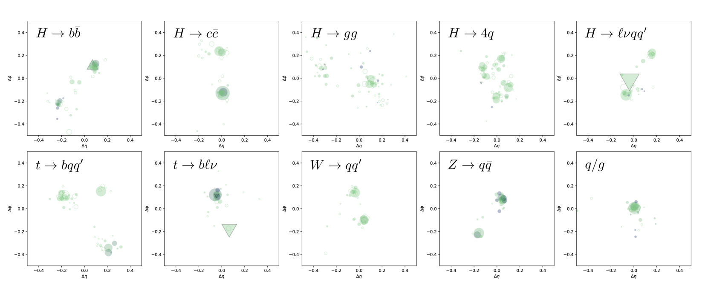

# JetClassGraphDataset
The JetClass dataset (introduced in ["Particle Transformer for jet tagging"](https://arxiv.org/abs/2202.03772)) is composed as follows:

### Dataset Size
125M total jets: 100M for training, 5M for validation, 20M for testing

10 jet classes equally distributed across the dataset

### Jet Categories
Background jets: Light quarks/gluons (q/g) - most common at LHC
Signal jets: From top quarks (t), W/Z/Higgs bosons with different decay modes

### Particle Structure
Each jet contains 10-100 particles (average 30-50 per jet)
Each particle has 17 input features across 3 categories:

- Kinematics: 4-vector (E, px, py, pz) + derived variables (7 features)

- Particle ID: Electric charge + 5-class particle type encoding (6 features)

- Trajectory displacement: Impact parameters for charged particles (4 features)

Following the repository of [PCN: a deep learning approach to jet tagging utilizing novel graph construction methods and Chebyshev graph convolutions](https://github.com/YVSemlani/PCN-Jet-Tagging), we construct a graph dataset in Pytorch Geometric including fully connected scenario and a k-NN one. In particular for k-NN we use Scipy cKDTree for efficient nearest neighbor lookup.

# Citations
Qu, Huilin and Li, Congqiao and Qian, Sitian, A Large-Scale Dataset for Deep Learning in Jet Physics, https://doi.org/10.5281/zenodo.6619768
Semlani, Y., Relan, M. & Ramesh, K. PCN: a deep learning approach to jet tagging utilizing novel graph construction methods and Chebyshev graph convolutions. J. High Energ. Phys. 2024, 247 (2024). https://doi.org/10.1007/JHEP07(2024)247
